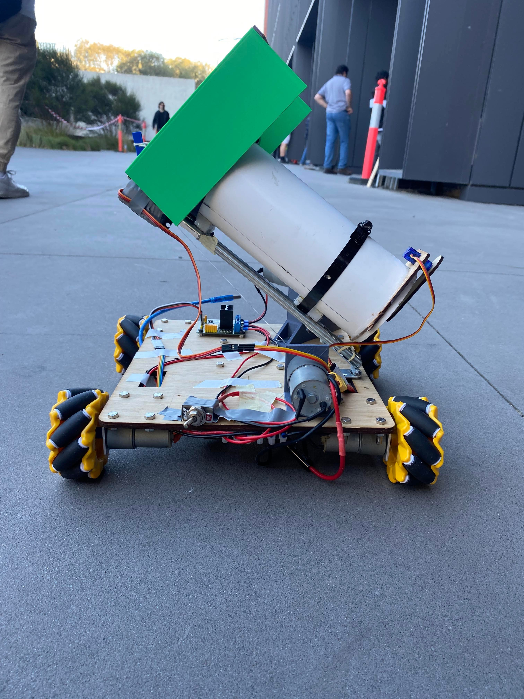
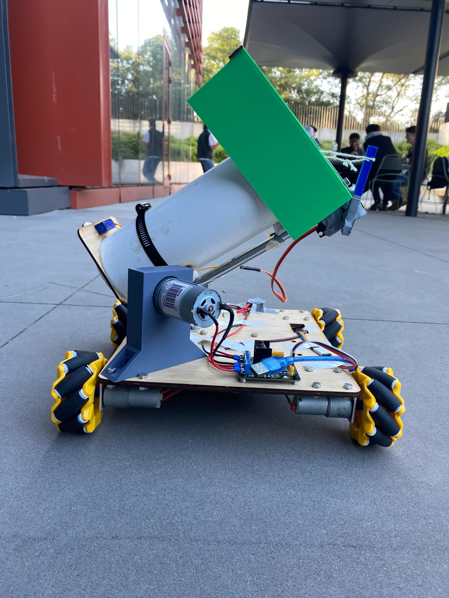

# 🤖 Warman Design & Build Competition Robot

## 📌 Overview
This project involved designing and prototyping an autonomous transport system for the 37th Warman Design and Build Competition.

The objective was to develop a robot capable of autonomously collecting and transporting six “seed pods” (tennis balls) from designated zones to an incinerator within 120 seconds, while satisfying strict spatial constraints (400mm cube).

The system was activated with a single input and executed a fully autonomous sequence.

---

## 🖼️ Project Gallery

<!-- Add more images if needed -->
<!--  -->

---

## 🧠 System Architecture

The robot was designed as a mobile manipulation system integrating locomotion, actuation, and control.

### Core Components:

- **Microcontroller (Arduino Mega)**
  - Controlled all actuation and execution logic
  - Pre-programmed motion and task sequence using C

- **Drive System**
  - 4 omniwheels for holonomic movement
  - Enabled flexible navigation in tight competition space

- **Actuation System**
  - 1 high-torque motor for arm lifting  
  - 1 motor for arm extension/retraction  
  - Servo motor for opening/closing storage  

- **Storage System**
  - Onboard container to hold multiple balls before delivery  

- **Power System**
  - Battery-powered system supplying all motors and electronics  

---

## 🔁 System Workflow

1. System activated via single trigger  
2. Robot follows pre-coded movement sequence  
3. Arm collects tennis balls  
4. Balls stored onboard  
5. Robot transports balls to destination  
6. Storage releases balls into incinerator  

---

## ⚙️ Engineering Decisions

### 🔹 Omniwheel Drive System
Chosen to provide **holonomic motion**, allowing movement in all directions without rotation.  
This significantly improved maneuverability under strict time constraints.

---

### 🔹 Arduino Mega
Selected due to:
- High number of GPIO pins  
- PWM capability for motor control  
- Sufficient processing for sequential control logic  

---

### 🔹 Open-Loop Control System
The system was implemented without sensors or feedback due to time and experience constraints.

This resulted in:
- Positioning inaccuracies  
- Accumulated error over time  
- Reduced robustness to environmental variation  

---

## 🔄 Design Iteration & Engineering Trade-offs

The system evolved significantly through multiple design iterations.

---

### 🔹 Arm Mechanism Redesign
- Initial design used **rack and pinion** for precise control  
- Replaced with a **winch-based system** due to:
  - Space constraints (interference with wheels)  
  - Manufacturing complexity and tolerance issues  

**Trade-off:** Reduced precision but improved feasibility and reliability  

---

### 🔹 Scoop Mechanism Redesign
- Initial sideways scoop prioritised speed  
- Failed to reliably collect lower-positioned balls  

Final design:
- Larger scoop positioned underneath the ball  
- Servo-assisted motion to lift ball into storage  

**Insight:** Reliability was prioritised over speed  

---

### 🔹 Storage & Extension System Simplification
- Initial design used dual compartments  
- Replaced with a **single PVC pipe + drawer sliders**  

Benefits:
- Reduced friction points  
- Simplified mechanical design  
- Improved reliability and consistency  

---

## 🖼️ Design Evolution

---

## 🧪 Testing & Real-World Challenges

Extensive testing revealed critical real-world issues:

- Fishing line snapping in arm mechanism  
- Servo motor failures under load  
- Insufficient motor power → required upgrade  
- Limited testing time before competition  

Testing was conducted sequentially to isolate and fix subsystem issues.

---

## 🏁 Competition Performance

- Successfully transported all required objects  
- Achieved a functional autonomous system  
- Ranked **36th out of 79 teams**  

Despite mechanical and electrical issues, the system demonstrated strong adaptability and robustness under competition conditions.

---

## 🛠️ Tech Stack

- C (Embedded programming)  
- Arduino Mega  
- DC Motors + Motor Drivers  
- Servo Motor  
- CAD Design (SOLIDWORKS / NX)  
- 3D Printing & Mechanical Fabrication  

---

## ⚠️ Limitations

- Open-loop system without feedback control  
- Limited accuracy and repeatability  
- Sensitive to environmental variations and setup  

---

## 🧠 Key Learnings

This project marked a major transition from theoretical learning to real-world engineering.

Key takeaways:

- Importance of **closed-loop control systems**  
- Need for **sensor integration** in robotics  
- Value of **early and continuous testing**  
- Real-world systems require **robustness, not just functionality**  

---

## 🚀 Future Improvements

- Integrate sensors (encoders, vision, IMU)  
- Implement closed-loop motion control  
- Improve navigation accuracy and repeatability  
- Enhance mechanical robustness and reliability  

---

## 🎥 Demo

[Watch Robot in Action](ADD_VIDEO_LINK_HERE)

---

## 👥 Team

Team 54 – Warman Competition 2024  
- Rio Abraham  
- Tanim  
- Hayden  
- Tom  
- Aaron  

---

## 📫 Contact

- Email: rioabraham01@gmail.com  
- LinkedIn: ADD_LINK_HERE  
